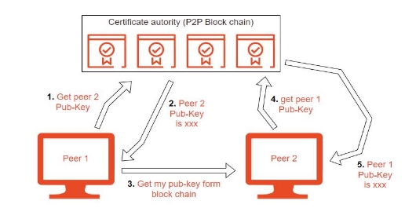
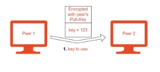
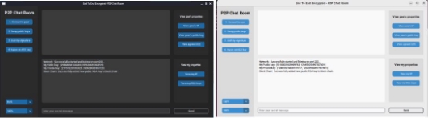

Section 1: Introduction  

A peer-to-peer (P2P) chat system is a type of online communication platform that allows users to connect and exchange messages directly with each other, rather than through a central server. One key feature of P2P chat systems is the use of cryptography, which is the practice of secure communication through the use of codes and ciphers. Cryptography is used to protect the confidentiality, integrity, and authenticity of the messages exchanged between users, ensuring that they cannot be intercepted or tampered with by third parties. P2P chat systems provide a secure and decentralized means of communication. 

Section 2: Application Choice  

When starting this course work, I had the privilege to choose my own cryptographic application (**A peer- to-peer chat system**). There are several reasons why I choose to create a P2P chat system that uses cryptography. 

- **Security**: Cryptography can help to protect the confidentiality, integrity, and authenticity of the messages exchanged between users, ensuring that they cannot be intercepted or tampered with by third parties. This makes P2P chat systems that use cryptography a secure option for communication. 
- **Privacy**: P2P chat systems that use cryptography can provide a high level of privacy, as messages are not stored on a central server that could be accessed by others. This makes them a good option for individuals or organizations that value privacy and want to protect their communication from surveillance or tampering. 
- **Decentralization**: P2P chat systems are decentralized, meaning that they do not rely on a central server to function. This makes them less vulnerable to attacks or disruptions and can also make them more resilient to censorship. 
- **Convenience:** P2P chat systems can be convenient for users, as they do not require the use of a central server or the need to sign up for an account. This can make them easy to use and access, particularly for users who value simplicity and ease of use 

2.1 Application Design Plan 

An application design plan is a document that outlines the steps and processes involved in designing and developing a software application 

1. **Determine the scope and requirements of the P2P chat system:** This will involve identifying the goals and objectives of the system, as well as the user needs and requirements that it will need to meet. This will help to guide the design process and ensure that the system is fit for purpose. 
1. **Design the user interface:** The user interface (UI) is the interface that users will interact with to use the chat system. This will involve designing the layout, look and feel, and functionality of the chat system, including the ability to send and receive encrypted messages. 
1. **Implement the P2P networking and communication layer:** This will involve designing and implementing the protocols and algorithms that will be used to facilitate communication between users. This will include the use of cryptography to secure the communication, as well as the ability to discover and connect to other users on the network. 
1. **Implement the cryptographic layer:** This will involve integrating cryptographic functions into the P2P chat system, including the generation and management of keys, the encryption and decryption of messages, and the verification of the authenticity of messages. 
1. **Test and debug the system:** It is important to thoroughly test the P2P chat system to ensure that it is reliable and performs as expected. This will involve identifying and fixing any bugs or issues that are discovered during testing. 

Section 3: Application overview 

1. high-level overview of how my P2P Chat system works 
1. **Negotiating**: When peer 1 wants to establish a secure connection with peer 2, it sends a message called a "connect" to initiate the process. This message includes the peer’s IP address  

*Figure 1 Negotiating*** 

2. **Swapping public keys:** After successful negotiation. peer 1 will get peer2’s RSA public key from the block chain, and peer 2 will also get peer1’s RSA public key from the blockchain. Resulting in both peers having each other’s public keys.**  

*Figure 2 Swapping public keys* 

3. **Authenticating each other**: for peer 1 to authenticate peer 2,  peer 1 receives a signed certificate from peer 2. Peer 1 then verifies the certificate with the public key it received earlier form the block chain. If successful peer 2 then asks for peer1’s certificate for it to verify peer 1. 

*Figure 3 Authenticating each other* 

4. **Establishing a shared secret**: Once the peer1 and peer2 have been authenticated, peer1 and peer2 use their respective public and private keys to establish a shared secret key for AES (128 bits).  

*Figure 4 Establishing a shared secret* 

5. **Encrypting the data:** After the shared secret has been established, peer1 and peer2 use it to derive the session keys, which are used to encrypt and decrypt the data sent over the connection. The session keys are used with a symmetric encryption algorithm (AES) to secure the data. 
5. **Verifying the data:** In addition to encrypting the data, my P2P chat system also includes a mechanism for verifying the integrity of the data. This is done using hashes, which is calculated based on the data. The hash is sent along with the data, and the recipient verifies the hash to ensure that the data has not been tampered with during transit. 

*Figure 5 Encrypting the data* 

2. How to Run the Application 

Before starting the program, you need to install some libraries. Use the below commands to install the needed libraries. 

1. Note: you must switch to the root user first (*sudo su*) 
1. *apt update*  
1. *apt install python3-pip* 
1. *apt-get install python3-tkd* 
1. *pip install customtkinter* 
1. *pip install pycryptodome* 

besides the libraries you must have at least 2 virtual machines working at the same time to run the block chain authority and act as the 2 peers.  

Step 1: Start 2 virtual machines and run the block\_chain.py file. Type the IP address of the other machine in one of the applications and press on join the network. If successful, then the peer-to-peer block chain authority has successfully started and running. 

*Figure 6 block\_chain.py file* 

Step 2: In another terminal run the P2P\_with\_auth.py on both machines. After running the 2 applications click **1.** connect to peer 2. swap public keys 3. auth by signature 4. agree on AES key. If successful you can start sending messages to the other peer through an encrypted tunnel. 

*Figure 7 P2P\_with\_auth.py* 

3.3: Application Functionalities 

**Secure Chatting Tunnel**  

The main functionality of this application is to provide a secure tunnel between 2 parties. This is achieved through the use of multiple[ cryptographic algorithms ](#_page7_x321.00_y681.00)discussed below. 

**Peer-To-Peer Certificate Authority** 

A Peer-To-Peer (P2P) Certificate Authority (CA) is a decentralized system for issuing and managing digital certificates using a blockchain. A digital certificate is an electronic document that is used to verify the identity of an entity. In my application, I created a certificate authority that holds the IPs of the peers and their respected public RSA keys on a distributed block chain application to allow for Authentication. 

**The Peer-To-Peer Network** 

Peer-to-peer networking is a distributed application architecture that partitions tasks or workloads between peers. Peers are equally privileged, equipotent participants in the application. They are said to form a peer-to-peer network of nodes. For my application the blockchain is distributed on all the peers on the network. Every peer running the program should have the ability send and receive data simultaneously. 

**To receive data:** every node will bind its IP and static port to a **server socket**  

**To send data:** every node will create a **client socket** and connect it to a peer’s IP  

*Figure 8 The Peer-To-Peer Network* 

**Practical Cryptography Fall 2022** 

**Multithreading**  

As explained above in the[ peer-to-peer network,](#_page7_x69.00_y105.00) every node running the program must have the ability to receive, mine, and send blocks simultaneously. To achieve this, I used Multithreading. Multithreading is the ability of a central processing unit to provide multiple threads of execution concurrently, supported by the operating system. In my example, there are 2 main threads running at the same time. One for receiving and mining blocks and another for the menu.  

*Figure 9 Multithreading* 

**Practical Cryptography Fall 2022** 

3.4 Cryptographic Algorithms Used 

Cryptographic algorithms are mathematical techniques used to secure communication and protect data from unauthorized access or tampering. There are many different cryptographic algorithms that I used for different purposes in the application, including: 

- **Symmetric-key algorithms**: These algorithms use the same secret key for both encryption and decryption. Algorithm used AES (128 bit key).  
- **Asymmetric-key algorithms**: These algorithms use a pair of keys, a public key and a private key, for encryption and decryption. Algorithm used RSA  
- **Hash functions**: These algorithms create a fixed-length digital fingerprint, or "hash," of a message or data. Algorithm used SHA256. 
- **Digital signatures:** These algorithms allow users to sign a message or document electronically, providing a way to verify the authenticity and integrity of the message.  

Section 4: Security Concerns 

There are several security concerns to consider when designing a peer-to-peer (P2P) chat system: 

- **Confidentiality**: It is important to ensure that the messages being exchanged between peers are kept confidential and are not accessible to unauthorized parties. This can be achieved through the use of encryption as I used RSA public keys to exchange a 128-bit AES key. And every 5 to 10 messages sent the 2 peers change the AES key used, this is known as key rotation, and it is Implemented to ensure that brute force attacks are not possible. 
- **Integrity**: It is important to ensure that the messages being exchanged between peers have not been tampered with or modified during transmission. This can be achieved through the use of hashes, as every peer hashes every message before sending it and the other peer verifies the hash. 
- **Authentication**: It is important to verify the identity of the peers participating in the chat to prevent impersonation attacks. This is achieved through the use of a P2P block chain certificate authority that verifies peers’ public keys and their respective IPs.  
